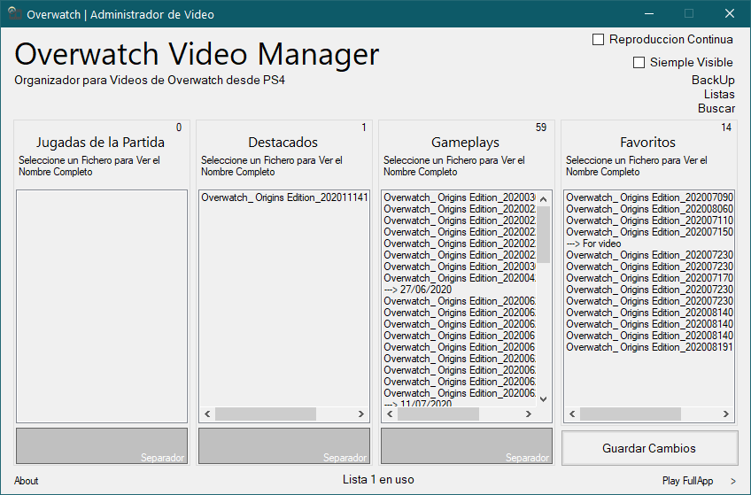

# Game Video Manager
> Administrador de para video de juegos

 

  

  <h3 align="center">Administrador de Videos para Videojuegos</h3>

  

    Legado del antiguo software llamado <a href="http://elcris009.comule.com/Download_PS4VideoManager.html">PS4 VideoManager</a>
     
     
   
  

## Development setup

EZ to setup. Just install Microsoft Visual Studio, get .NET Framework 4 and double click in ``CRZVideoManager.sln``

## Release History

Can be found at [My Web Page/PS4VideoManager](http://elcris009.comule.com/Download_PS4VideoManager.html)  (i still don't kill the name)

## Notes

It's ugly, but it works. It's a 2017 project.

## Meta

Cristopher Cáceres. Main developer in @Worcome-Studios

[My GitHub](https://github.com/Urfenox)

[Worcome Studios](http://worcomestudios.comule.com/)

## Contributing

1. Fork it
2. Create your feature branch
3. Commit your changes
4. Push to the branch
5. Create a new Pull Request
